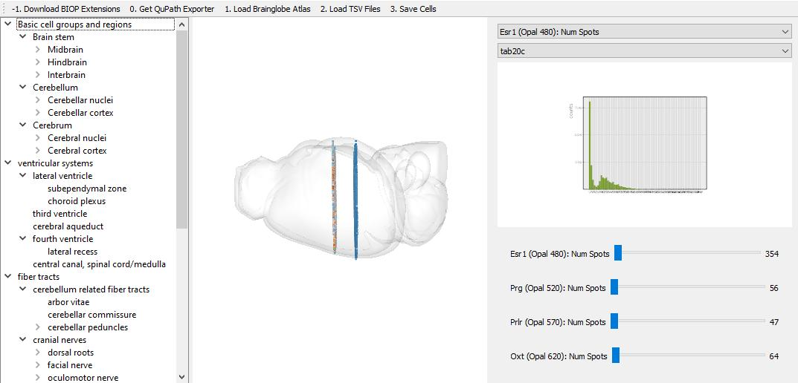

# ABBA-QuPath Registration Exporter

[](https://github.com/nickdelgrosso/ABBA-QuPath-RegistrationAnalysis/actions/workflows/python-app.yml)
[](https://coveralls.io/github/nickdelgrosso/ABBA-QuPath-RegistrationAnalysis?branch=master)
[](https://sonarcloud.io/dashboard?id=nickdelgrosso_ABBA-QuPath-RegistrationAnalysis)

A Python app and Groovy script that helps export transformed cell detections
from ABBA-registered data stored in QuPath projects.



## Installation


### Python version
This software has been tested on **Python 3.9**


### First-Time Installation
```
pip install ABBA-QuPath-RegistrationExporter
```


### Upgrading to Latest Version

```
pip install --upgrade ABBA-QuPath-RegistrationExporter
```

## Running Software
To launch the programm and open the GUI
```
regexport
```

### How to use
1. **Download BIOP Extensions**

Provide empty directory to download required files from BIOP

2. **Get QuPath Exporter**

Download and Save the .groovy script to download and to save .tsv file from QuPath.

Please provide a name and save it to the destination directory.

3. **Load Brainglobe Atlas**

When using for the first time, this button downloads the Brainglobe Atlas - it is currently using the **allen_mouse_25um** version.

Press the button to display the 3D view of the atlas and to load the whole hierarchy of the brain regions.

4. **Load TSV Files**

Provide the path the .tsv file(s) to load in the software, multiselection is required for multiple sections viewing.

5. **Use the left-hand panel**

When clicking on the brain (sub)region name, it will only display cells located in the chosen region.

Multiselection is possible to display different regions simultaneously.

6. **Use the right-hand panel** 

* First drop-down menu is to select according to which criteria the colormap will be applied.

e.g. BrainRegion -> 1 color per different region

e.g. CustomColumns (from the .tsv file) -> 1 color per different value

* Second drop-down menu is to select the colormap.
* Figure displays Histogram and cumulative histogram from the selected content in the first drop-down menu.
* Sliders are to set up threshold according for each CustomColumns, and to ignore cells that are above those thresholds. The *ignored* cells will then be OFF on the brain atlas visualization. **Only the cells that are visualized on the atlas will be saved in the last step**

7. **Save Cells**

Provide the name and path to save the output result as .csv or .feather file. *.feather file is a compressed version of .csv*
By default, it is saving the follogin content for each cells (position + custom columns + acronym/name of the finest sub-region area in the brain atlas + original image/.tsv file).

You can choose to save **Selected cells only**, in that case it is saving only the result for the displayed cells. The Acronym and BrainRegion fields will be the one selected in the hierarchy in the left-hand panel.

## Running Tests

```
git clone https://github.com/nickdelgrosso/ABBA-QuPath-RegistrationAnalysis
cd ABBA-QuPath-RegistrationAnalysis
pip install -e .[dev]
python -m pytest
```
